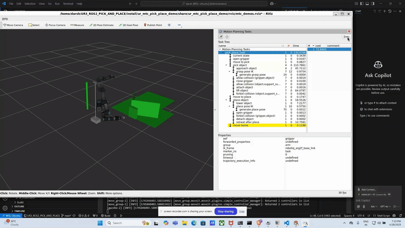
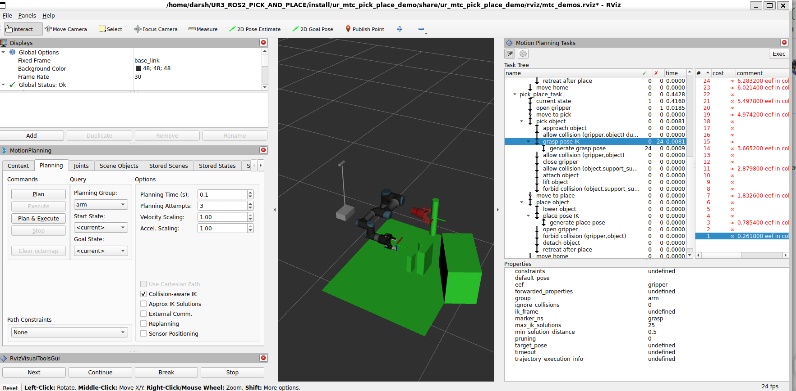
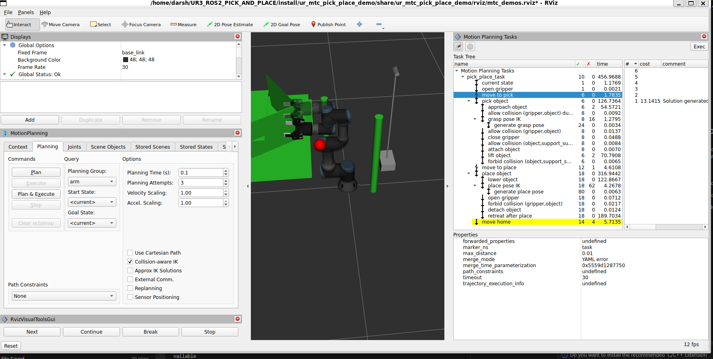
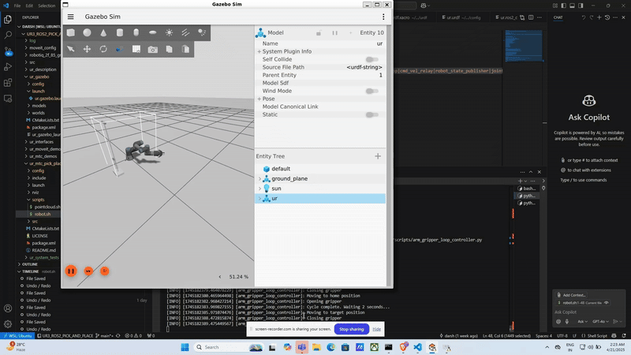
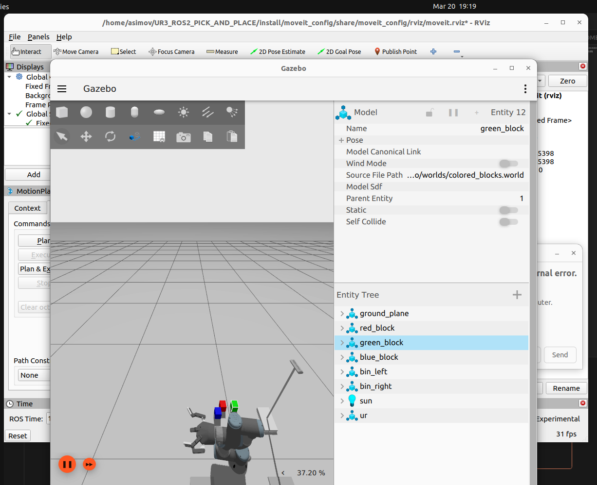
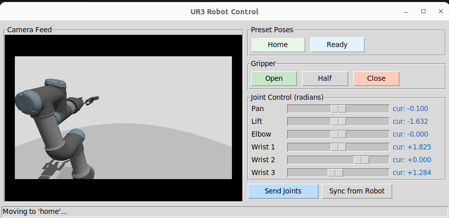

# UR Robotic Arm with Robotiq 2-Finger Gripper for ROS 2

📖 Related Blog Post: For behind-the-scenes details and the full development journey, check out the companion Medium article:
👉 👉 [*How I’m Building an Autonomous Pick-and-Place System with ROS 2 Jazzy and Gazebo Harmonic*](https://medium.com/@darshmenon02/how-i-am-building-an-autonomous-pick-and-place-system-with-ros-2-jazzy-and-gazebo-harmonic-6474cbcc8dc7) 

The blog dives into simulation setup, robotic control, MoveIt Task Constructor, and lessons learned—perfect if you're curious about the engineering side or want to replicate the project from scratch.


This project integrates the Robotiq 2-Finger Gripper with a Universal Robots UR3 arm using **ROS 2 Humble or Jazzy** and **Ignition Gazebo**. It includes URDF models, ROS 2 control configuration, simulation launch files, MoveIt Task Constructor pick-and-place, vision-based object detection, LLM-driven task planning (Ollama), and demonstration recording for behavior cloning.

> ✅ **Note:** This setup uses **fixed mimic joint configuration** for the Robotiq gripper to support simulation in **newer Gazebo (Harmonic)**. Only the primary `finger_joint` receives commands—mimic joints automatically follow.

---

## Demo 


.gif>)

## 📦 Installation

Make sure you have [ROS 2 Humble](https://docs.ros.org/en/humble/index.html) or [ROS 2 Jazzy](https://docs.ros.org/en/jazzy/index.html) and Ignition Gazebo installed.

### 1. Clone the Repository
```bash
git clone https://github.com/darshmenon/UR3_ROS2_PICK_AND_PLACE.git
cd UR3_ROS2_PICK_AND_PLACE
```

### 2. Install ROS Dependencies
```bash
# Replace $ROS_DISTRO with humble or jazzy
sudo apt install ros-$ROS_DISTRO-rviz2 \
                 ros-$ROS_DISTRO-joint-state-publisher \
                 ros-$ROS_DISTRO-robot-state-publisher \
                 ros-$ROS_DISTRO-ros2-control \
                 ros-$ROS_DISTRO-ros2-controllers \
                 ros-$ROS_DISTRO-controller-manager \
                 ros-$ROS_DISTRO-joint-trajectory-controller \
                 ros-$ROS_DISTRO-position-controllers \
                 ros-$ROS_DISTRO-gz-ros2-control \
                 ros-$ROS_DISTRO-ros2controlcli \
                 ros-$ROS_DISTRO-moveit \
                 ros-$ROS_DISTRO-cv-bridge \
                 ros-$ROS_DISTRO-tf2-ros \
                 ros-$ROS_DISTRO-tf2-geometry-msgs
```

### 3. Install Python Dependencies
```bash
pip3 install -r requirements.txt
# Ollama is required for the LLM planner:
# Install it from https://ollama.com
# Then pull your preferred model (default is llama2:latest):
ollama pull llama2:latest
```

### 4. Build the Workspace
```bash
colcon build --symlink-install
source install/setup.bash
```

---

## 🧩 MoveIt Task Constructor Setup

To enable advanced pick-and-place planning with MoveIt 2, this project supports [MoveIt Task Constructor (MTC)](https://github.com/ros-planning/moveit_task_constructor).

**This repo already includes a patched MTC source** in `src/moveit_task_constructor/` that works for both **ROS 2 Humble and Jazzy** — no extra cloning or patching needed. Just build normally:

```bash
colcon build --symlink-install
```

If you are setting up MTC in a **separate workspace**, follow the full guide:

📄 [`ur_mtc_pick_place_demo/README.md`](ur_mtc_pick_place_demo/README.md)

This includes:
- Cloning the correct MTC branch (`humble` or `jazzy`)
- Installing dependencies
- Fixes for planning scene execution issues
- Rebuild instructions

---

## 🚀 Launch Instructions

### Launch Full Simulation in Gazebo
```bash
ros2 launch ur_gazebo ur.gazebo.launch.py
```

### Launch RViz Visualization (UR3 + Gripper)
```bash
ros2 launch ur_description view_ur.launch.py ur_type:=ur3
```

### Launch Gripper Visualization Alone
```bash
ros2 launch robotiq_2finger_grippers robotiq_2f_85_gripper_visualization/launch/test_2f_85_model.launch.py
```

### Launch Live Point Cloud Viewer (Gazebo + RViz)
Launches the simulation and opens RViz showing the live RGB point cloud from the onboard Intel D435 camera:
```bash
bash ur_mtc_pick_place_demo/scripts/pointcloud.sh
```
Or launch just the RViz viewer (if simulation is already running):
```bash
source install/setup.bash
ros2 launch ur_gazebo point_cloud_viewer.launch.py
```
The point cloud is published on `/camera_head/depth/color/points` with `frame_id: camera_head_depth_optical_frame`.

To save a snapshot of the point cloud to a PLY file:
```bash
source install/setup.bash
python3 testing/point_cloud_viewer.py --save
# Saved to /tmp/pointcloud_<timestamp>.ply
```

---

## 🤖 Move the Arm from CLI

Send a simple trajectory:
```bash
ros2 action send_goal /arm_controller/follow_joint_trajectory control_msgs/action/FollowJointTrajectory \
'{
  "trajectory": {
    "joint_names": [
      "shoulder_pan_joint",
      "shoulder_lift_joint",
      "elbow_joint",
      "wrist_1_joint",
      "wrist_2_joint",
      "wrist_3_joint"
    ],
    "points": [
      {
        "positions": [0.0, -1.57, 1.57, 0.0, 1.57, 0.0],
        "time_from_start": { "sec": 2, "nanosec": 0 }
      }
    ]
  }
}'
```

---

## 🔁 Run Arm-Gripper Automation Script

Run a full pick-return-release loop:
```bash
python3 ~/UR3_ROS2_PICK_AND_PLACE/ur_system_tests/scripts/arm_gripper_loop_controller.py
```

---

## 🦾 Grasp Detection (`ur_grasp`)

Estimates grasp poses from the Intel D435 point cloud. Two backends auto-selected at runtime:

| Backend | How | Install |
|---------|-----|---------|
| **simple_grasping** (primary) | PCL RANSAC segmentation → `moveit_msgs/Grasp[]` | `sudo apt install ros-humble-simple-grasping` ✅ installed |
| **numpy centroid** (fallback) | Colour filter + centroid + height extent — no extra deps | built-in |

```bash
source install/setup.bash

# Terminal 1 — simulation
ros2 launch ur_gazebo ur.gazebo.launch.py

# Terminal 2 — grasp detection node
ros2 launch ur_grasp grasp_detection.launch.py colour:=red

# Terminal 3 — trigger detection + see result
python3 testing/test_grasp.py --colour red

# Detect AND execute the grasp:
python3 testing/test_grasp.py --colour blue --execute

# Watch grasp arrow in RViz: topic /ur_grasp/grasp_marker
```

**How it works (numpy backend):**
1. Subscribe to `/camera_head/depth/color/points`
2. HSV colour filter → isolate target cylinder points
3. Z passthrough (remove floor/ceiling)
4. Centroid → `(x, y)` of cylinder
5. Height extent → `grasp_z = min_z + 0.30 * height` (30% up for reliable 2F-85 contact)
6. Publish as `geometry_msgs/PoseStamped` on `/ur_grasp/grasp_pose`

**Alternate world with more objects:**
```bash
ros2 launch ur_gazebo ur.gazebo.launch.py world_file:=pick_and_place_demo.world

# Pick red cylinder from that world:
python3 testing/pick_cylinders.py --red
```

---

## 🤖 Sequential Hierarchical Pick-and-Place

Picks both cylinders (blue → bin_left, green → bin_right) using a 10-step hierarchical plan:
`INIT → PRE_GRASP → DESCEND → GRASP → LIFT → TRANSPORT → LOWER → RELEASE → RETREAT → RETURN`

```bash
source install/setup.bash

# Pick both cylinders (default)
python3 testing/pick_cylinders.py

# Only one cylinder
python3 testing/pick_cylinders.py --blue
python3 testing/pick_cylinders.py --green

# Print plan without executing
python3 testing/pick_cylinders.py --dry
```

> Requires the full simulation (`ur.gazebo.launch.py`) to be running first.

---

## 🖥️ Standalone Robot Control GUI

A tkinter-based GUI for arm teleoperation and live camera feed:

```bash
source install/setup.bash
python3 ur_llm_planner/scripts/robot_gui.py
```

Features:
- **Live camera feed** from the onboard Intel D435 (color stream)
- **Preset pose buttons** — Home, Ready
- **Gripper control** — Open, Half, Close
- **Per-joint sliders** (6 joints) — auto-sync to robot state on startup
- **Send Joints** — executes slider positions via Pilz PTP
- **Sync from Robot** — snaps sliders to current joint positions
- Status bar shows live feedback

> Requires the full simulation (`ur.gazebo.launch.py`) to be running first.

---

## ⚡ Custom Zig-Zag Motion Demo
To run the custom Cartesian (LIN) zig-zag motion demo using the MoveIt 2 PILZ Industrial Motion Planner:
```bash
ros2 run ur_moveit_demos custom_zigzag_motion
```
*Note: Make sure the Gazebo simulation (`ur.gazebo.launch.py`) has been running for at least 45 seconds so all controllers are initialized before starting the node.*

---

## 📝 MTC Demo Script

To run the full MTC demo with the UR3 and Robotiq gripper, execute the following steps:

### 1. **Make the Bash Script Executable**
```bash
chmod +x ~/UR3_ROS2_PICK_AND_PLACE/ur_mtc_pick_place_demo/scripts/robot.sh
```

### 2. **Run the Script**
Execute the script to launch the complete simulation:
```bash
~/UR3_ROS2_PICK_AND_PLACE/ur_mtc_pick_place_demo/scripts/robot.sh
```

This script will:
- Launch the **Gazebo** simulation with the UR3 robot and gripper.
- Launch **MoveIt 2** with the necessary configurations for pick-and-place tasks.
- Adjust the **camera position** in the simulation.
- Start the **Pick-and-Place demo** with MTC.

---

## 📸 Screenshots

### UR3 with Robotiq Gripper in RViz  


### Robotiq Gripper Close-up  


### Simulation in Gazebo  


### RViz Overview  


### mtc Overview  


### mtc Overview  



### mtc Pipline  



### loop


### colour_pick


### cam_view

---

## 🤖 AI / ML Stack

Three new packages extend the project with autonomous perception and planning:

### Vision-Based Perception (`ur_perception`)
Color + optional YOLO object detection from the onboard Intel D435 camera. Detects red/green/blue/yellow objects, estimates 3D pose via depth + TF2, and publishes them to the MoveIt planning scene automatically.

```bash
ros2 launch ur_perception perception.launch.py
# Watch detections:
ros2 topic echo /detected_objects
# View annotated camera feed in RViz: /detection_image
```

### LLM Task Planning (`ur_llm_planner`)
Natural language → robot motion. Send a plain English command and a local Ollama model figures out the pick-and-place sequence. No API key or cloud dependency required.

```bash
# Ensure Ollama is running and model pulled:
# ollama serve
# ollama pull llama2:latest   (default)
# Or use a different model:  ollama pull llama3.2:3b

ros2 launch ur_llm_planner llm_planner.launch.py
# Override model:
# ros2 launch ur_llm_planner llm_planner.launch.py ollama_model:=llama3.2:3b

# Send a command:
ros2 topic pub --once /llm_planner/command std_msgs/msg/String \
  "{data: 'pick up the red block and place it in the left bin'}"
```

### Demonstration Recording + Behavior Cloning (`ur_data_collector`)
Record robot demonstrations to HDF5 files, then train a BC policy.

```bash
# Start recording
ros2 launch ur_data_collector data_collector.launch.py
ros2 service call /data_collector/start_recording std_srvs/srv/Trigger
# ... run a demo ...
ros2 service call /data_collector/stop_recording std_srvs/srv/Trigger

# Train BC policy
python3 ur_data_collector/scripts/train_bc.py \
  --data_dir ~/ur3_demos \
  --output_dir ~/bc_policy \
  --epochs 50
```

### Full Demo (all-in-one)
```bash
# Launches Gazebo + MoveIt + perception automatically
ros2 launch ur_gazebo full_demo.launch.py

# With LLM planner enabled:
ros2 launch ur_gazebo full_demo.launch.py use_llm_planner:=true

# Use the new colored blocks world (default):
ros2 launch ur_gazebo full_demo.launch.py world:=colored_blocks.world
```

---

## 🤝 Contributing

Feel free to open pull requests or issues if you have improvements or bug reports.


