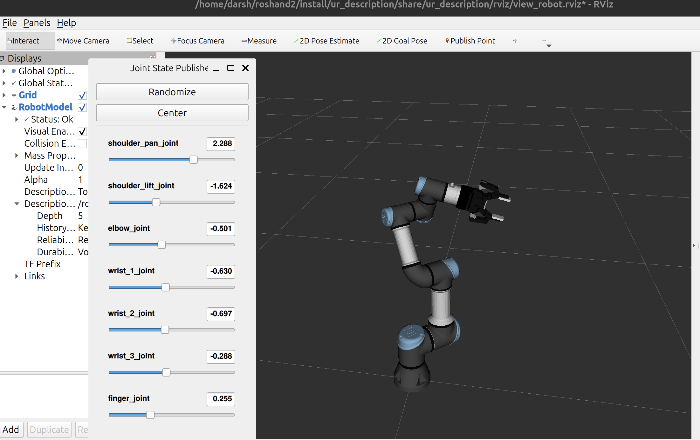
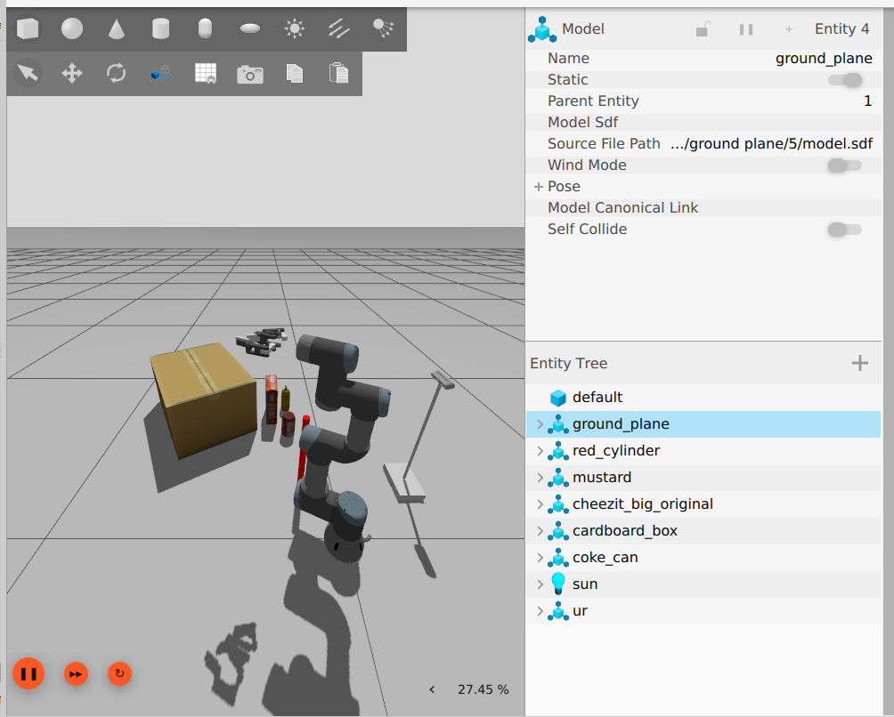
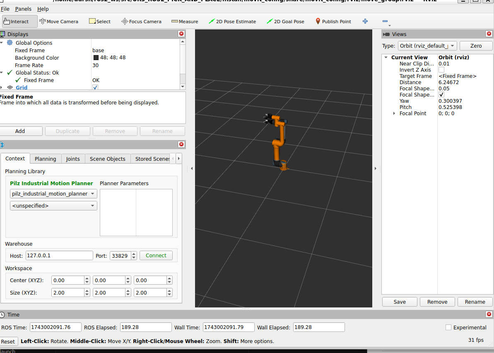
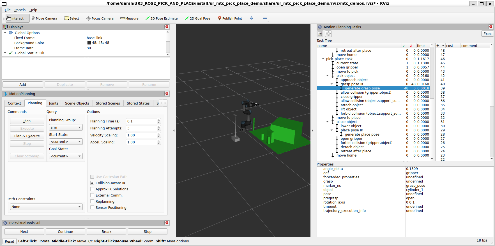

# UR Robotic Arm with Robotiq 2-Finger Gripper for ROS 2

Related Blog Post: For behind-the-scenes details and the full development journey, check out the companion Medium article:
[How I'm Building an Autonomous Pick-and-Place System with ROS 2 Jazzy and Gazebo Harmonic](https://medium.com/@darshmenon02/how-i-am-building-an-autonomous-pick-and-place-system-with-ros-2-jazzy-and-gazebo-harmonic-6474cbcc8dc7)

This project integrates the Robotiq 2-Finger Gripper with a Universal Robots UR3 arm using **ROS 2 Humble** and **Ignition Gazebo**. It includes URDF models, ROS 2 control configuration, simulation launch files, MoveIt Task Constructor pick-and-place, vision-based object detection, LLM-driven task planning (Ollama), and demonstration recording for behavior cloning.

> **Note:** Mimic joints use state_interface only — Ignition Gazebo enforces URDF `<mimic>` tags natively. Only `finger_joint` receives commands; all five knuckle/finger joints follow automatically.

---

## Demo


.gif)

---

## Installation

Make sure you have [ROS 2 Humble](https://docs.ros.org/en/humble/index.html) and Ignition Gazebo installed.

### 1. Clone the Repository

```bash
git clone https://github.com/darshmenon/UR3_ROS2_PICK_AND_PLACE.git
cd UR3_ROS2_PICK_AND_PLACE
```

### 2. Install ROS Dependencies

```bash
sudo apt install \
  ros-humble-rviz2 \
  ros-humble-joint-state-publisher \
  ros-humble-robot-state-publisher \
  ros-humble-ros2-control \
  ros-humble-ros2-controllers \
  ros-humble-controller-manager \
  ros-humble-joint-trajectory-controller \
  ros-humble-position-controllers \
  ros-humble-gz-ros2-control \
  ros-humble-ros2controlcli \
  ros-humble-moveit \
  ros-humble-moveit-ros-perception \
  ros-humble-simple-grasping \
  ros-humble-cv-bridge \
  ros-humble-tf2-ros \
  ros-humble-tf2-geometry-msgs \
  ros-humble-pcl-ros \
  python3-pip
```

### 3. Install Python Dependencies

```bash
pip3 install -r requirements.txt
# Ollama is required for the LLM planner:
# Install from https://ollama.com
# Then pull your preferred model:
ollama pull llama2:latest
```

### 4. Build the Workspace

```bash
colcon build --symlink-install
source install/setup.bash
```

The repo already includes a patched MTC source in `src/moveit_task_constructor/` — no extra cloning needed. The build compiles `moveit_task_constructor_core`, `moveit_task_constructor_capabilities` (provides `ExecuteTaskSolutionCapability`), and `moveit_task_constructor_visualization` (provides the RViz MTC panel).

---

## ROS 2 Humble vs Jazzy Compatibility

| Feature | Humble | Jazzy |
|---|---|---|
| MTC `PipelinePlanner` constructor | `(node, pipeline_id_map)` | `(node)` then `setPipeline()` |
| `ExecuteTaskSolutionCapability` | build from `capabilities/` in this repo | included in `moveit_task_constructor_core` |
| `create_service` QoS arg | requires `rclcpp::QoS` object | accepts integer depth |
| STOMP planner | not available (not installed) | available |

The patched MTC source in `src/moveit_task_constructor/` works on **Humble**. For Jazzy, use the upstream `jazzy` branch from [ros-planning/moveit_task_constructor](https://github.com/ros-planning/moveit_task_constructor).

---

## Launch Instructions

### Full MTC Pick-and-Place Demo (recommended)

Launches Gazebo + MoveIt + planning scene server + MTC demo in sequence:

```bash
bash ur_mtc_pick_place_demo/scripts/robot.sh
```

This script:
1. Launches Gazebo with `pick_and_place_demo.world`
2. Starts `move_group` with RViz (`mtc_demos.rviz`)
3. Starts the PCL-based planning scene server (detects objects from point cloud)
4. Runs the MTC pick-and-place node

### Point Cloud Viewer (Gazebo + RViz)

```bash
bash ur_mtc_pick_place_demo/scripts/pointcloud.sh
```

Or just the RViz viewer if simulation is already running:

```bash
ros2 launch ur_gazebo point_cloud_viewer.launch.py
```

Point cloud is published on `/camera_head/depth/color/points` with `frame_id: camera_head_depth_optical_frame`.

### Full Simulation Only

```bash
ros2 launch ur_gazebo ur.gazebo.launch.py
```

### RViz Visualization (no simulation)

```bash
ros2 launch ur_description view_ur.launch.py ur_type:=ur3
```

---

## Move the Arm from CLI

```bash
ros2 action send_goal /arm_controller/follow_joint_trajectory control_msgs/action/FollowJointTrajectory \
'{
  "trajectory": {
    "joint_names": [
      "shoulder_pan_joint", "shoulder_lift_joint", "elbow_joint",
      "wrist_1_joint", "wrist_2_joint", "wrist_3_joint"
    ],
    "points": [
      {
        "positions": [0.0, -1.57, 1.57, 0.0, 1.57, 0.0],
        "time_from_start": { "sec": 2, "nanosec": 0 }
      }
    ]
  }
}'
```

---

## Sequential Pick-and-Place (Python)

Picks cylinders using a 10-step hierarchical plan:
`INIT → PRE_GRASP → DESCEND → GRASP → LIFT → TRANSPORT → LOWER → RELEASE → RETREAT → RETURN`

```bash
source install/setup.bash

# Pick both cylinders (default)
python3 testing/pick_cylinders.py

# Pick specific colour
python3 testing/pick_cylinders.py --blue
python3 testing/pick_cylinders.py --green
python3 testing/pick_cylinders.py --red

# Dry run (print plan, no execution)
python3 testing/pick_cylinders.py --dry
```

Requires the full simulation to be running first.

---

## Grasp Detection (ur_grasp)

Estimates grasp poses from the Intel D435 point cloud. Two backends:

| Backend | Method | Dependency |
|---|---|---|
| simple_grasping (primary) | PCL RANSAC → `moveit_msgs/Grasp[]` | `ros-humble-simple-grasping` |
| numpy centroid (fallback) | Colour HSV filter + centroid + height | built-in, no extra deps |

```bash
source install/setup.bash

# Terminal 1 — simulation
ros2 launch ur_gazebo ur.gazebo.launch.py

# Terminal 2 — grasp detection node
ros2 launch ur_grasp grasp_detection.launch.py colour:=red

# Terminal 3 — trigger detection
python3 testing/test_grasp.py --colour red

# Detect and execute grasp
python3 testing/test_grasp.py --colour blue --execute
```

Grasp arrow visible in RViz at topic `/ur_grasp/grasp_marker`.

**Numpy centroid method:**
1. Subscribe to `/camera_head/depth/color/points`
2. HSV colour filter isolates target cylinder points
3. Compute centroid `(x, y)` and height extent
4. `grasp_z = min_z + 0.30 * height` (30% from bottom = optimal 2F-85 contact)
5. Publish as `PoseStamped` on `/ur_grasp/grasp_pose`

---

## Data Collection (ur_data_collector)

Records robot demonstrations to HDF5 files for behavior cloning training.

```bash
# Start the collector
ros2 launch ur_data_collector data_collector.launch.py

# Start a recording episode
ros2 service call /data_collector/start_recording std_srvs/srv/Trigger

# ... perform the demonstration ...

# Stop and save
ros2 service call /data_collector/stop_recording std_srvs/srv/Trigger
```

Files saved to `~/ur3_demos/demo_<timestamp>.h5`. Each episode contains:
- `rgb_images` (N, H, W, 3)
- `joint_positions` (N, 6)
- `gripper_positions` (N,)
- `timestamps` (N,)

Train a behavior cloning policy:

```bash
python3 ur_data_collector/scripts/train_bc.py \
  --data_dir ~/ur3_demos \
  --output_dir ~/bc_policy \
  --epochs 50
```

---

## Robot Control GUI

A tkinter GUI for arm teleoperation:

```bash
source install/setup.bash
python3 ur_llm_planner/scripts/robot_gui.py
```

Features: live camera feed, preset poses (Home/Ready), gripper control (Open/Half/Close), per-joint sliders, Pilz PTP execution.

---

## LLM Task Planning (ur_llm_planner)

Natural language to robot motion via local Ollama model:

```bash
# Ensure Ollama is running:
# ollama serve && ollama pull llama2:latest

ros2 launch ur_llm_planner llm_planner.launch.py

# Send a command:
ros2 topic pub --once /llm_planner/command std_msgs/msg/String \
  "{data: 'pick up the red block and place it in the left bin'}"
```

---

## Vision-Based Perception (ur_perception)

Color + optional YOLO object detection from the onboard Intel D435:

```bash
ros2 launch ur_perception perception.launch.py
ros2 topic echo /detected_objects
# Annotated feed in RViz: /detection_image
```

---

## Zig-Zag Motion Demo

```bash
ros2 run ur_moveit_demos custom_zigzag_motion
```

Wait at least 45 seconds after launching the simulation before running this.

---

## Point Cloud in Planning Scene (Octomap)

The green/grey voxels in the RViz PlanningScene display come from MoveIt's `PointCloudOctomapUpdater`. This requires `ros-humble-moveit-ros-perception` (listed in installation above).

Config in `moveit_config/config/sensors_3d.yaml`:
- Topic: `/camera_head/depth/color/points`
- Max range: 1.5 m
- Update rate: 1 Hz

---

## Testing Scripts

All testing scripts are in `testing/`:

| Script | Purpose |
|---|---|
| `pick_cylinders.py` | Sequential hierarchical pick-and-place |
| `test_grasp.py` | Test grasp detection service |
| `point_cloud_viewer.py` | View point cloud in matplotlib |

---

## Screenshots

### UR3 with Robotiq Gripper in RViz



### Simulation in Gazebo



### RViz Overview



### MTC Overview



### MTC Pipeline


---

## Contributing

Feel free to open pull requests or issues for improvements or bug reports.
