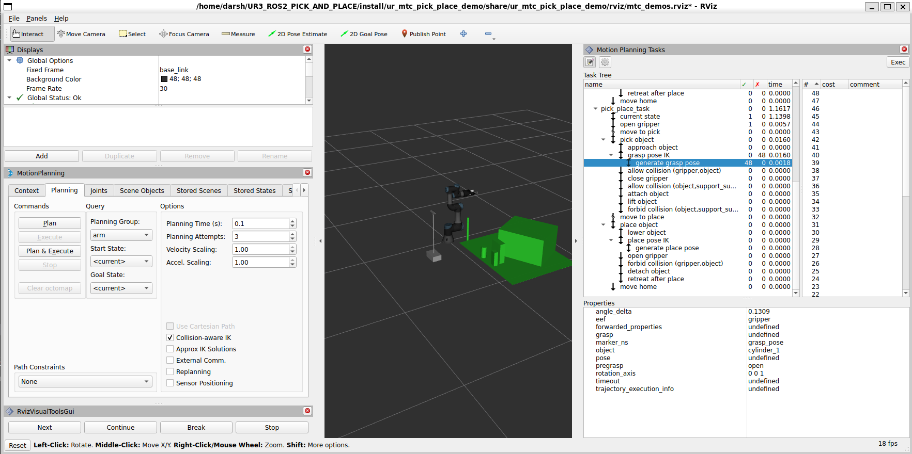
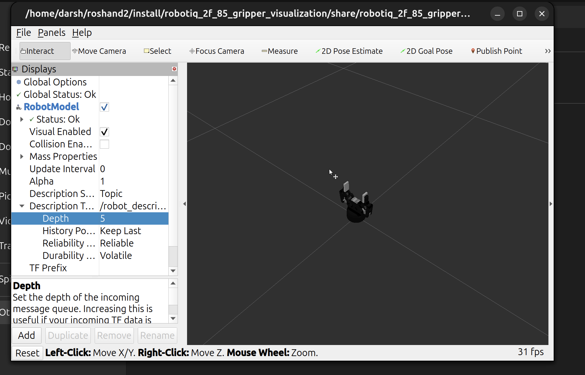

# UR Robotic Arm with Robotiq 2-Finger Gripper for ROS 2

Blog post (dev journey, engineering details): [How I'm Building an Autonomous Pick-and-Place System with ROS 2 Jazzy and Gazebo Harmonic](https://medium.com/@darshmenon02/how-i-am-building-an-autonomous-pick-and-place-system-with-ros-2-jazzy-and-gazebo-harmonic-6474cbcc8dc7)

UR3 + Robotiq 2-Finger Gripper on **ROS 2 Humble** + **Gazebo Harmonic**: URDF/ros2_control, MoveIt Task Constructor pick-and-place, vision-based detection, LLM task planning (Ollama), RL (SAC), and demo recording for behavior cloning.

**New here? Start with [Full MTC Pick-and-Place Demo](#full-mtc-pick-and-place-demo)** — one command to run.

<details>
<summary><strong>Table of Contents</strong></summary>

- [Installation](#installation)
- [MoveIt Task Constructor Setup](#moveit-task-constructor-setup)
- [Launch Instructions](#launch-instructions)
- [Supported Grippers](#supported-grippers)
- [Move the Arm from CLI](#move-the-arm-from-cli)
- [Full Autonomous Pipeline](#full-autonomous-pipeline)
- [Grasp Detection (ur_grasp)](#grasp-detection-ur_grasp)
- [UR3 Reinforcement Learning (SAC)](#ur3-reinforcement-learning-sac)
- [Robot Learning Datasets with LeRobot](#robot-learning-datasets-with-lerobot)
- [Force Control / Compliant Grasping (ur_force_control)](#force-control--compliant-grasping-ur_force_control)
- [Behavior Tree Task Planner (ur_bt_planner)](#behavior-tree-task-planner-ur_bt_planner)
- [Conveyor Belt Simulation (ur_conveyor)](#conveyor-belt-simulation-ur_conveyor)
- [Future Scope / Work in Progress](#future-scope--work-in-progress)

</details>

---

## Demo

.gif>)

---

## Installation

Requires [ROS 2 Humble](https://docs.ros.org/en/humble/index.html) and **Gazebo Harmonic** (`gz-sim` 8.x) — Ignition Fortress (gz-sim 6) will not work.

```bash
git clone https://github.com/darshmenon/UR3_ROS2_PICK_AND_PLACE.git
cd UR3_ROS2_PICK_AND_PLACE

export ROS_DISTRO=humble   # or jazzy
sudo apt install ros-$ROS_DISTRO-rviz2 ros-$ROS_DISTRO-joint-state-publisher \
  ros-$ROS_DISTRO-robot-state-publisher ros-$ROS_DISTRO-ros2-control \
  ros-$ROS_DISTRO-ros2-controllers ros-$ROS_DISTRO-controller-manager \
  ros-$ROS_DISTRO-joint-trajectory-controller ros-$ROS_DISTRO-position-controllers \
  ros-$ROS_DISTRO-gz-ros2-control ros-$ROS_DISTRO-ros2controlcli \
  ros-$ROS_DISTRO-moveit ros-$ROS_DISTRO-moveit-ros-perception \
  ros-$ROS_DISTRO-simple-grasping ros-$ROS_DISTRO-cv-bridge \
  ros-$ROS_DISTRO-tf2-ros ros-$ROS_DISTRO-tf2-geometry-msgs ros-$ROS_DISTRO-pcl-ros

# Jazzy only, also install: ros-jazzy-ros-gz-sim ros-jazzy-ros-gz-bridge ros-jazzy-moveit-planners-stomp
# (STOMP isn't packaged for Humble — leave it out, the planner init fails silently and is harmless)

pip3 install -r requirements.txt
pip3 install py-trees          # required for ur_bt_planner

# Ollama, for the LLM planner: install from https://ollama.com, then
ollama pull llama2:latest

colcon build --symlink-install
source install/setup.bash
```

---

## MoveIt Task Constructor Setup

[MTC](https://github.com/ros-planning/moveit_task_constructor) source is already patched and vendored in `src/moveit_task_constructor/` for both Humble and Jazzy — `colcon build` above covers it, no extra steps.

MTC needs MongoDB (`warehouse_ros_mongo`) running:

```bash
curl -fsSL https://www.mongodb.org/static/pgp/server-7.0.asc | \
  sudo gpg -o /usr/share/keyrings/mongodb-server-7.0.gpg --dearmor
echo "deb [ arch=amd64,arm64 signed-by=/usr/share/keyrings/mongodb-server-7.0.gpg ] https://repo.mongodb.org/apt/ubuntu jammy/mongodb-org/7.0 multiverse" | \
  sudo tee /etc/apt/sources.list.d/mongodb-org-7.0.list
sudo apt-get update && sudo apt-get install -y mongodb-org
sudo systemctl enable --now mongod
```

Verify with `mongosh`. Humble/Jazzy API differences: [`ur_mtc_pick_place_demo/README.md`](ur_mtc_pick_place_demo/README.md).

---

## Launch Instructions

### Full MTC Pick-and-Place Demo




```bash
source install/setup.bash
bash ur_mtc_pick_place_demo/scripts/robot.sh              # GUI
USE_GAZEBO_GUI=false bash ur_mtc_pick_place_demo/scripts/robot.sh   # headless
```

That script just runs three launches in order (sim+MoveIt → planning scene server → pick/place task). Success looks like `Task executed successfully`. Occasional execute `-3` is RRTConnect random-seed variance, not a bug — rerun, or use the [MTC retry wrapper](#mtc-retry-wrapper) for automatic retry.

`get_planning_scene_server` turns the head depth cloud into MoveIt collision objects: crops to the workspace, RANSAC-fits the support plane and object, and serves them via `/get_planning_scene_ur`. Falls back to a known table+cylinder if perception fails or `force_fallback_scene:=true`.

### Full Simulation in Gazebo

```bash
ros2 launch ur_gazebo ur.gazebo.launch.py                       # default, Robotiq 2F-85
ros2 launch ur_gazebo ur.gazebo.launch.py gripper:=robotiq_2f_140
ros2 launch ur_gazebo ur.gazebo.launch.py gripper:=onrobot_rg2   # or onrobot_rg6
ros2 launch ur_gazebo ur.gazebo.launch.py wrist_camera:=true     # eye-in-hand instead of head cam
```

| World | Table | Objects |
|---|---|---|
| `empty.world` | no | none |
| `empty_red_cylinder.world` | no | red cylinder at `(0.36, 0, 0.06)` |
| `pick_and_place_demo.world` | yes | red cylinder + YCB props |

Launch args: `use_rviz`, `use_move_group`, `use_gazebo_gui` (all default `true`), `gripper` (default `robotiq_2f_85`), `world_file`, `table_height`.

### Interactive MoveIt Planning in RViz

Starts move_group + RViz with `ompl` (default) and `pilz_industrial_motion_planner` pipelines.

1. **Planning Group** → `arm`
2. **Context** → Planning Library → `OMPL`, Planner → `RRTConnectkConfigDefault`
3. Drag the interactive marker to a goal, click **Plan & Execute**

Cartesian (straight-line) moves: RViz **Cartesian Path** tab, or Pilz `LIN`/`PTP`/`CIRC` planners. Configs: `moveit_config/config/ompl_planning.yaml`, `pilz_cartesian_limits.yaml`.

To attach RViz/MoveIt to a sim already running headless, use `moveit_config move_group.launch.py` with `use_move_group`/`use_rviz`/`use_sim_time` flags instead.

Wait ~10-15s after launch, then confirm:

```bash
ros2 control list_controllers   # arm_controller, gripper_controller, joint_state_broadcaster — all active
```

---

## Supported Grippers

| Gripper | Arg | Actuated joint | Range (open→closed) |
|---|---|---|---|
| Robotiq 2F-85 | `robotiq_2f_85` | `finger_joint` | 0.0 → 0.8 |
| Robotiq 2F-140 | `robotiq_2f_140` | `finger_joint` | 0.0 → 0.8 |
| OnRobot RG2 | `onrobot_rg2` | `gripper_joint` | 0.0 → 1.3 |
| OnRobot RG6 | `onrobot_rg6` | `gripper_joint` | 0.0 → 1.3 |

All use `position_controllers/GripperActionController`. Mimic joints are state-only — Gazebo Harmonic enforces `<mimic>` constraints at the physics level.



```bash
ros2 action send_goal /gripper_controller/gripper_cmd control_msgs/action/GripperCommand \
  "{command: {position: 0.5, max_effort: 50.0}}"
```

Useful debug commands: `ros2 topic echo /joint_states`, `ros2 topic hz /camera_head/depth/color/points`, `ros2 run tf2_ros tf2_echo base_link tool0`.

---

## Move the Arm from CLI

```bash
ros2 action send_goal /arm_controller/follow_joint_trajectory control_msgs/action/FollowJointTrajectory \
'{"trajectory": {"joint_names": ["shoulder_pan_joint","shoulder_lift_joint","elbow_joint","wrist_1_joint","wrist_2_joint","wrist_3_joint"],
  "points": [{"positions": [0.0, -1.57, 1.57, 0.0, 1.57, 0.0], "time_from_start": {"sec": 2, "nanosec": 0}}]}}'
```

Automation script: `python3 ur_system_tests/scripts/arm_gripper_loop_controller.py`. GUI: `python3 ur_system_tests/scripts/gui.py`.


---

## Full Autonomous Pipeline

`full_demo.launch.py` brings up Gazebo, MoveIt, perception, grasp detection, and a selectable brain (mutually exclusive):

```bash
ros2 launch ur_gazebo full_demo.launch.py brain:=llm      # Ollama, via /llm_planner/command
ros2 launch ur_gazebo full_demo.launch.py brain:=rl model_path:=ur_rl_training/models/checkpoints/<run>/best_model.zip
ros2 launch ur_gazebo full_demo.launch.py brain:=openvla task:="pick the red block and place it in the bin"
ros2 launch ur_gazebo full_demo.launch.py brain:=none     # perception + grasp only
```

Startup sequence: Gazebo+MoveIt → perception (60s) → grasp (62s) → brain (65s).

```
Camera/Depth  → ur_perception → /detected_objects        → LLM planner / RL policy
PointCloud2   → ur_grasp      → /ur_grasp/grasp_pose      → RL policy (overrides perception)
Camera        → OpenVLA       → /arm_controller/joint_trajectory
```

---

## Grasp Detection (ur_grasp)

Estimates grasp poses from the D435 point cloud — `simple_grasping` (PCL RANSAC, primary) or a built-in HSV-centroid fallback.

```bash
ros2 launch ur_grasp grasp_detection.launch.py colour:=red
python3 testing/test_grasp.py --colour red --execute
```

For eye-in-hand: launch sim with `wrist_camera:=true`, then point `grasp_detection.launch.py` at `camera_topic:=/camera_wrist/depth/color/points`. Publishes `/ur_grasp/grasp_pose` and `/ur_grasp/grasp_marker`.

---

## UR3 Reinforcement Learning (SAC)

Trains SAC in MuJoCo, deploys to Gazebo — reach → grasp → lift → place curriculum (auto-advances at eval reward ≥ 400), with domain randomization on mass/friction/size/noise.

```bash
cd ur_rl_training
python3 scripts/train.py --timesteps 3000000
python3 scripts/train.py --resume models/checkpoints/<run>/best_model   # resume from checkpoint
```

Deploy to Gazebo:

```bash
ros2 launch ur_gazebo ur.gazebo.launch.py world_file:=rl_policy_demo.world
ros2 launch ur_rl_training rl_policy.launch.py model_path:=ur_rl_training/models/checkpoints/<run>/best_model.zip
```

Key params: `action_scale` (0.1), `step_dt` (0.01), `control_rate_hz` (100), `phase` (0-3); object position auto-overridden by perception/grasp topics when running.

Headless eval: `python3 ur_rl_training/scripts/eval_headless.py --model <path> --episodes 20`.

---

## Robot Learning Datasets with LeRobot

For training ACT / Diffusion Policy / SmolVLA from Gazebo demonstrations.

```bash
# 1. Record demos
ros2 launch ur_gazebo full_demo.launch.py brain:=none use_gazebo_gui:=true
ros2 launch ur_data_collector data_collector.launch.py
ros2 service call /data_collector/start_recording std_srvs/srv/Trigger {}
# ...perform the task manually / with MTC...
ros2 service call /data_collector/stop_recording std_srvs/srv/Trigger {}
```

Episodes are saved as HDF5 to `~/ur3_demos` (RGB, 6 arm joints, gripper, timestamps, 7D actions).

```bash
# 2. Install LeRobot separately (needs Python 3.12, Humble uses 3.10)
cd ~/lerobot && python3.12 -m venv .venv && source .venv/bin/activate
pip install -e ".[training,smolvla]" h5py

# 3. Export
python ur_data_collector/scripts/export_lerobot_dataset.py \
  --input-dir ~/ur3_demos --output-root ~/lerobot_ur3_pickplace \
  --repo-id local/ur3_pickplace --task "pick the red block and place it in the bin"

# 4. Train (SmolVLA recommended — ~450M params, LeRobot-native)
lerobot-train --policy.path=lerobot/smolvla_base --dataset.repo_id=local/ur3_pickplace \
  --dataset.root=~/lerobot_ur3_pickplace --batch_size=8 --steps=20000 --output_dir=outputs/train/ur3_smolvla
```

Action convention throughout: 6 arm joint targets/deltas + 1 gripper command (7D). For RL refinement on top of a trained IL/VLA policy, use SAC (`ur_rl_training`) on the same convention and compare success rates — there's no supported way to load a VLA checkpoint directly into SAC.

---

## Force Control / Compliant Grasping (`ur_force_control`)

**Gripper contact** — monitors `finger_joint` effort to stop before crushing:

```bash
ros2 launch ur_force_control ft_monitor.launch.py
```
`/ft/finger_effort` (effort), `/ft/contact_detected` (bool), service `/ft/compliant_close`. Also via `MotionExecutor.compliant_close_gripper()` / `.compliant_pick()`.

**Arm-level wrench estimation** (no F/T sensor — inferred from joint effort via `F ≈ pinv_damped(Jᵀ)·τ_ext`, gravity via Pinocchio):

```bash
ros2 launch ur_force_control wrench_estimator.launch.py
ros2 topic echo /ft/estimated_wrench
ros2 service call /ft/zero_wrench std_srvs/srv/Trigger {}
```
Params: `force_threshold_n` (15.0), `damping_lambda` (0.05). Note: `/joint_states` effort readback doesn't reliably track commanded torque, so absolute wrench values aren't trustworthy yet — relative/contact detection is fine.

**Joint impedance control** (torque mode, `τ = K(q_des−q) − D·q̇ + g(q)`):

```bash
ros2 launch ur_force_control joint_impedance.launch.py
ros2 control switch_controllers --deactivate arm_controller --activate forward_command_controller_effort
ros2 topic pub --once /joint_impedance_controller/target_positions std_msgs/msg/Float64MultiArray "{data: [0.0, -1.57, 1.57, 0.0, 1.57, 0.0]}"
ros2 control switch_controllers --deactivate forward_command_controller_effort --activate arm_controller   # hand back
```
Use `arm_controller` for MoveIt; switch to `forward_command_controller_effort` only for compliant hold/contact. Service: `/joint_impedance_controller/hold_current_pose`.

---

## Behavior Tree Task Planner (`ur_bt_planner`)

Hierarchical [py_trees](https://py-trees.readthedocs.io/) pick-and-place with IK-failure retry via a Selector fallback:

```bash
ros2 launch ur_bt_planner bt_planner.launch.py pick_x:=0.35 pick_y:=0.0 pick_z:=0.05 place_x:=0.15 place_y:=0.30 place_z:=0.08
ros2 service call /bt/run_pick_place std_srvs/srv/Trigger {}
```

### MTC Retry Wrapper

Wraps the [MTC demo](#full-mtc-pick-and-place-demo) with automatic retry (`py_trees.decorators.Retry`) since occasional `-3` execute failures resolve on a fresh attempt:

```bash
ros2 launch ur_gazebo ur.gazebo.launch.py world_file:=pick_and_place_demo.world gripper:=robotiq_2f_85 \
  use_rviz:=false use_move_group:=true use_gazebo_gui:=true
ros2 launch ur_bt_planner mtc_retry.launch.py
ros2 service call /mtc_bt/run std_srvs/srv/Trigger {}
ros2 topic echo /mtc_bt/status
```
`max_attempts` (default 5) is a launch arg.

---

## Conveyor Belt Simulation (`ur_conveyor`)

Spawns random-color boxes at the belt entry, moves them to the pick zone, publishes `/conveyor/object_ready`.

```bash
ros2 launch ur_conveyor conveyor.launch.py spawn_interval_s:=6.0 belt_speed:=0.06
ros2 service call /conveyor/start std_srvs/srv/Trigger {}
```

Topics/services: `/conveyor/object_ready`, `/conveyor/picked`, `/conveyor/start`, `/conveyor/stop`.

---

## Future Scope / Work in Progress

- Real robot deployment (swap Gazebo hardware interface for the live UR3 driver)
- Fine-tune OpenVLA on collected demonstrations for sim-to-real
- 6-DoF object pose estimation from depth for grasp orientation
- Multi-object sorting: BT planner + conveyor + perception together
- **Vision (`ur_perception`)**: color/YOLO detection works; multi-view reconstruction (`reconstruct.launch.py`) is inspection-only, not yet consumed by the pick pipeline
- **LLM planner (`ur_llm_planner`)**: relative moves (`move the gripper up by 10 centimeters`) and named poses work; pick-by-description doesn't yet — the color detector reports zero objects for this scene

Contributions welcome, especially around sim stability, transfer learning, and perception-to-action integration.
