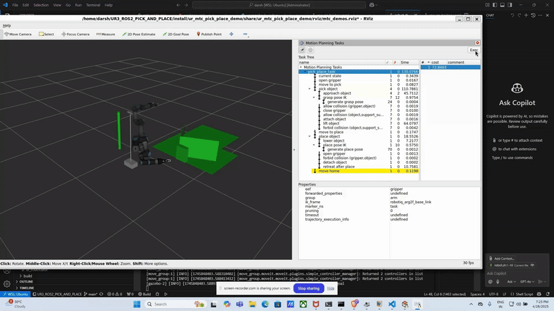
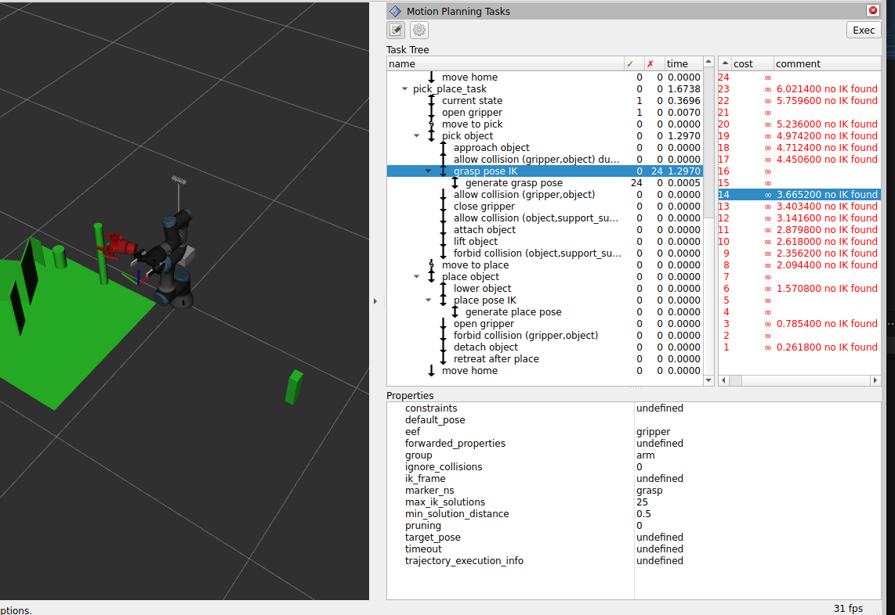
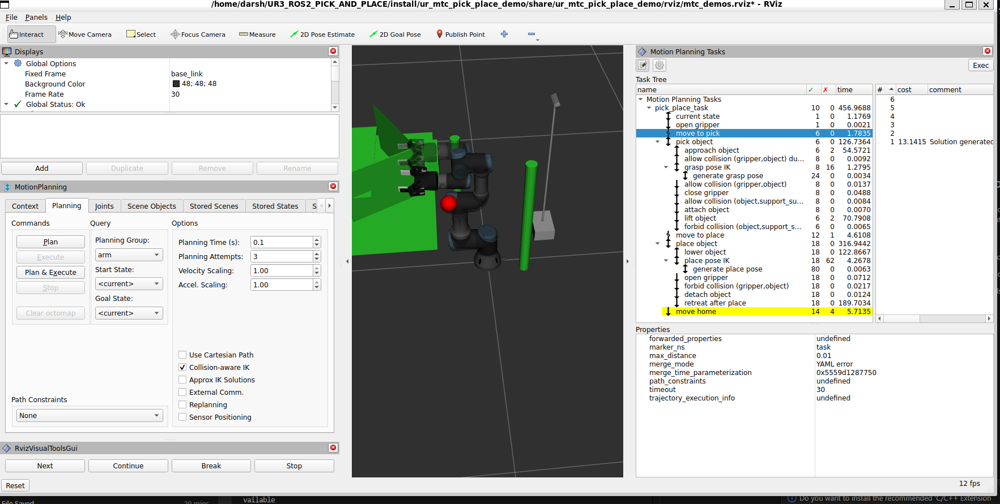
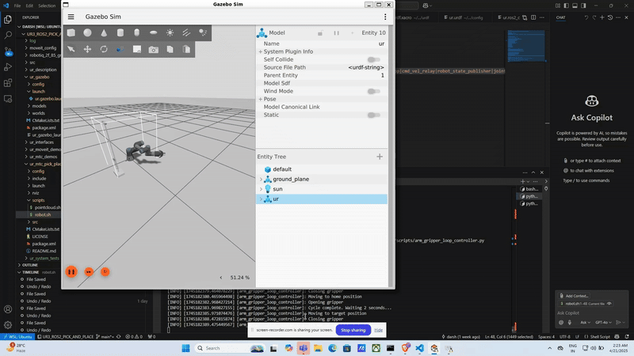

# UR Robotic Arm with Robotiq 2-Finger Gripper for ROS 2

Related Blog Post: For behind-the-scenes details and the full development journey, check out the companion Medium article:
[How I'm Building an Autonomous Pick-and-Place System with ROS 2 Jazzy and Gazebo Harmonic](https://medium.com/@darshmenon02/how-i-am-building-an-autonomous-pick-and-place-system-with-ros-2-jazzy-and-gazebo-harmonic-6474cbcc8dc7)

The blog dives into simulation setup, robotic control, MoveIt Task Constructor, and lessons learned — perfect if you're curious about the engineering side or want to replicate the project from scratch.

This project integrates the Robotiq 2-Finger Gripper with a Universal Robots UR3 arm using **ROS 2 Humble** and **Gazebo Harmonic**. It includes URDF models, ROS 2 control configuration, simulation launch files, MoveIt Task Constructor pick-and-place, vision-based object detection, LLM-driven task planning (Ollama), and demonstration recording for behavior cloning.

---

## Demo



.gif>)

---

## Installation

Make sure you have [ROS 2 Humble](https://docs.ros.org/en/humble/index.html) and **Gazebo Harmonic** (`gz-sim` 8.x) installed. Ignition Fortress (`ign gazebo` / gz-sim 6) will not work — the world file and bridge packages are Harmonic-specific.

### 1. Clone the Repository

```bash
git clone https://github.com/darshmenon/UR3_ROS2_PICK_AND_PLACE.git
cd UR3_ROS2_PICK_AND_PLACE
```

### 2. Install ROS Dependencies

```bash
# Set to humble or jazzy
export ROS_DISTRO=humble

sudo apt install ros-$ROS_DISTRO-rviz2 \
                 ros-$ROS_DISTRO-joint-state-publisher \
                 ros-$ROS_DISTRO-robot-state-publisher \
                 ros-$ROS_DISTRO-ros2-control \
                 ros-$ROS_DISTRO-ros2-controllers \
                 ros-$ROS_DISTRO-controller-manager \
                 ros-$ROS_DISTRO-joint-trajectory-controller \
                 ros-$ROS_DISTRO-position-controllers \
                 ros-$ROS_DISTRO-gz-ros2-control \
                 ros-$ROS_DISTRO-ros2controlcli \
                 ros-$ROS_DISTRO-moveit \
                 ros-$ROS_DISTRO-moveit-ros-perception \
                 ros-$ROS_DISTRO-simple-grasping \
                 ros-$ROS_DISTRO-cv-bridge \
                 ros-$ROS_DISTRO-tf2-ros \
                 ros-$ROS_DISTRO-tf2-geometry-msgs \
                 ros-$ROS_DISTRO-pcl-ros
```

> **Jazzy only** — add these two extra packages:
> ```bash
> sudo apt install ros-jazzy-ros-gz-sim ros-jazzy-ros-gz-bridge \
>                  ros-jazzy-moveit-planners-stomp
> ```
> STOMP is not packaged for Humble so leave it out there — the planner init fails silently and is harmless.

### 3. Install Python Dependencies

```bash
pip3 install -r requirements.txt
# Ollama is required for the LLM planner:
# Install from https://ollama.com
# Then pull your preferred model:
ollama pull llama2:latest
```

### 4. Build the Workspace

```bash
colcon build --symlink-install
source install/setup.bash
```

---

## MoveIt Task Constructor Setup

This project supports [MoveIt Task Constructor (MTC)](https://github.com/ros-planning/moveit_task_constructor) for advanced pick-and-place planning.

**This repo already includes a patched MTC source** in `src/moveit_task_constructor/` that works for both **ROS 2 Humble and Jazzy** — no extra cloning needed. Just build normally:

```bash
colcon build --symlink-install
```

### MongoDB (required for warehouse_ros_mongo)

MTC uses `warehouse_ros_mongo` to persist planning scenes and trajectories. MongoDB must be installed and running before launching the demo:

```bash
curl -fsSL https://www.mongodb.org/static/pgp/server-7.0.asc | \
  sudo gpg -o /usr/share/keyrings/mongodb-server-7.0.gpg --dearmor

echo "deb [ arch=amd64,arm64 signed-by=/usr/share/keyrings/mongodb-server-7.0.gpg ] https://repo.mongodb.org/apt/ubuntu jammy/mongodb-org/7.0 multiverse" | \
  sudo tee /etc/apt/sources.list.d/mongodb-org-7.0.list

sudo apt-get update && sudo apt-get install -y mongodb-org
sudo systemctl start mongod && sudo systemctl enable mongod
```

Verify it is running: `mongosh` should connect to `mongodb://127.0.0.1:27017`.

For Humble/Jazzy API differences and troubleshooting, see [`ur_mtc_pick_place_demo/README.md`](ur_mtc_pick_place_demo/README.md).

---

## Launch Instructions

### Full MTC Pick-and-Place Demo

```bash
bash ur_mtc_pick_place_demo/scripts/robot.sh
```

Launches Gazebo + MoveIt + planning scene server + MTC demo in sequence.

### Launch Full Simulation in Gazebo

```bash
# Default — Robotiq 2F-85
ros2 launch ur_gazebo ur.gazebo.launch.py

# Robotiq 2F-140
ros2 launch ur_gazebo ur.gazebo.launch.py gripper:=robotiq_2f_140

# OnRobot RG2
ros2 launch ur_gazebo ur.gazebo.launch.py gripper:=onrobot_rg2

# OnRobot RG6
ros2 launch ur_gazebo ur.gazebo.launch.py gripper:=onrobot_rg6
```

---

## Supported Grippers

| Gripper | Arg | Actuated joint | Mimic joints |
|---|---|---|---|
| Robotiq 2F-85 | `robotiq_2f_85` | `finger_joint` | 5 |
| Robotiq 2F-140 | `robotiq_2f_140` | `finger_joint` | 5 |
| OnRobot RG2 | `onrobot_rg2` | `gripper_joint` | 5 |
| OnRobot RG6 | `onrobot_rg6` | `gripper_joint` | 5 |

All four grippers use `position_controllers/GripperActionController` for the single commanded joint. Mimic joints are state-only — Gazebo Harmonic enforces the `<mimic>` constraints at the physics level.

### Verify Controllers After Launch

Controllers take ~40 s to spawn. Run this to confirm all three are `active`:

```bash
ros2 control list_controllers
```

Expected output (same for all grippers):

```
arm_controller[joint_trajectory_controller/JointTrajectoryController] active
gripper_controller[position_controllers/GripperActionController] active
joint_state_broadcaster[joint_state_broadcaster/JointStateBroadcaster] active
```

### Command the Gripper from CLI

**Robotiq (2F-85 / 2F-140)** — `finger_joint` range `0.0` (open) → `0.8` (closed):

```bash
ros2 action send_goal /gripper_controller/gripper_cmd \
  control_msgs/action/GripperCommand \
  "{command: {position: 0.5, max_effort: 50.0}}"
```

**OnRobot (RG2 / RG6)** — `gripper_joint` range `0.0` (open) → `1.3` (closed):

```bash
ros2 action send_goal /gripper_controller/gripper_cmd \
  control_msgs/action/GripperCommand \
  "{command: {position: 0.65, max_effort: 50.0}}"
```

### Launch Point Cloud Viewer (Gazebo + RViz)

```bash
bash ur_mtc_pick_place_demo/scripts/pointcloud.sh
```

### Launch RViz Visualization (UR3 + Gripper)

```bash
ros2 launch ur_description view_ur.launch.py ur_type:=ur3
```

### Launch Gripper Visualization Alone

```bash
ros2 launch robotiq_2finger_grippers robotiq_2f_85_gripper_visualization/launch/test_2f_85_model.launch.py
```

---

## Move the Arm from CLI

```bash
ros2 action send_goal /arm_controller/follow_joint_trajectory control_msgs/action/FollowJointTrajectory \
'{
  "trajectory": {
    "joint_names": [
      "shoulder_pan_joint",
      "shoulder_lift_joint",
      "elbow_joint",
      "wrist_1_joint",
      "wrist_2_joint",
      "wrist_3_joint"
    ],
    "points": [
      {
        "positions": [0.0, -1.57, 1.57, 0.0, 1.57, 0.0],
        "time_from_start": { "sec": 2, "nanosec": 0 }
      }
    ]
  }
}'
```

---

## Run Arm-Gripper Automation Script

```bash
python3 ~/UR3_ROS2_PICK_AND_PLACE/ur_system_tests/scripts/arm_gripper_loop_controller.py
```


---

## Grasp Detection (ur_grasp)

Estimates grasp poses from the Intel D435 point cloud. Two backends:

| Backend | Method | Dependency |
|---|---|---|
| simple_grasping (primary) | PCL RANSAC → `moveit_msgs/Grasp[]` | `ros-$ROS_DISTRO-simple-grasping` |
| numpy centroid (fallback) | Colour HSV filter + centroid + height | built-in |

```bash
ros2 launch ur_grasp grasp_detection.launch.py colour:=red
python3 testing/test_grasp.py --colour red --execute
```

---

## Standalone Robot Control GUI

```bash
source install/setup.bash
python3 ur_llm_planner/scripts/robot_gui.py
```

Features: live camera feed, preset poses, gripper control (Open/Half/Close), per-joint sliders, Pilz PTP execution.

---

## Custom Zig-Zag Motion Demo

```bash
ros2 run ur_moveit_demos custom_zigzag_motion
```

Wait at least 45 seconds after launching the simulation before running this.

---

## MTC Demo Script

### Make the Script Executable

```bash
chmod +x ~/UR3_ROS2_PICK_AND_PLACE/ur_mtc_pick_place_demo/scripts/robot.sh
```

### Run the Script

```bash
~/UR3_ROS2_PICK_AND_PLACE/ur_mtc_pick_place_demo/scripts/robot.sh
```

This script launches the Gazebo simulation, MoveIt 2, the planning scene server, and the MTC pick-and-place demo.

---

## Screenshots

### UR3 with Robotiq Gripper in RViz


### Robotiq Gripper Close-up


### Simulation in Gazebo


### RViz Overview


### MTC Overview


### Pick Error



### MTC Pipeline



### Loop Demo



---

## AI / ML Stack

### SAC RL Pick-and-Place Policy (`ur_rl_training`)

Trains a Soft Actor-Critic (SAC) policy in MuJoCo and deploys it to Gazebo. The policy learns to reach, grasp, lift, and place a cube using the UR3 + Robotiq 2F-85.

**Features:**
- VecNormalize observation and reward normalisation for stable training
- 4-phase curriculum: reach → grasp → lift → place; auto-advances to full task once eval reward ≥ 400
- Phase-distribution and success-rate metrics logged to TensorBoard every eval interval
- Domain randomisation: object mass, friction, size (±20%), observation noise, joint jitter

**Train:**

```bash
cd ur_rl_training
python3 scripts/train.py --timesteps 3000000
# Resume from checkpoint (loads vecnormalize.pkl automatically):
python3 scripts/train.py --resume models/checkpoints/<run>/best_model
```

Best model and normalisation stats saved to `ur_rl_training/models/checkpoints/<run>/`.

**View policy in Gazebo:**

```bash
# Terminal 1 — Gazebo + MoveIt:
source install/setup.bash
ros2 launch ur_gazebo ur.gazebo.launch.py world_file:=rl_policy_demo.world

# Terminal 2 — RL policy node:
source install/setup.bash
ros2 launch ur_rl_training rl_policy.launch.py \
  model_path:=ur_rl_training/models/checkpoints/<run>/best_model.zip
```

Optional launch parameters:

| Parameter | Default | Description |
|-----------|---------|-------------|
| `action_scale` | `0.1` | Joint delta per step (increase for faster motion, e.g. `0.4`) |
| `step_dt` | `0.01` | Trajectory point duration in seconds |
| `control_rate_hz` | `100.0` | Policy inference rate |
| `object_x/y/z` | `0.35/0.0/0.045` | Object position in `base_link` frame |
| `drop_x/y/z` | `0.35/0.20/0.02` | Drop zone position |
| `phase` | `1.0` | Curriculum phase (0=reach, 1=grasp, 2=lift, 3=place) |

**Headless evaluation:**

```bash
python3 ur_rl_training/scripts/eval_headless.py \
  --model ur_rl_training/models/checkpoints/<run>/best_model.zip \
  --episodes 20
```

---

## Contributing

Pull requests and issues are welcome, especially around simulation stability, transfer learning, and perception-to-action integration.

---

## Future Scope

- Add a vision-language-action pipeline for task-conditioned robot control.
- Bring back LLM task planning as a stable feature for high-level commands such as pick, place, sort, and multi-step tabletop tasks.
- Connect perception, RL, and language planning more tightly so detected objects can be selected and manipulated from natural-language instructions.
- Improve MuJoCo-to-Gazebo transfer so learned grasping policies behave more consistently on the UR3 with the Robotiq gripper.

---

## Work in Progress

The following features are actively being developed and are not yet fully integrated.

### Grasp Detection (`ur_grasp`)

Point-cloud grasp estimation for tabletop objects from the Intel D435 depth stream.

Verified in this workspace:

- package imports successfully after `source install/setup.bash`
- installed executable: `ros2 run ur_grasp grasp_node`

Launch:

```bash
source install/setup.bash
ros2 run ur_grasp grasp_node

# Or with optional args (colour filter and backend):
ros2 launch ur_grasp grasp_detection.launch.py colour:=red backend:=auto
```

Trigger one detection:

```bash
ros2 service call /ur_grasp/detect std_srvs/srv/Trigger {}
```

Healthy signs:

- advertises `/ur_grasp/detect`
- subscribes to `/camera_head/depth/color/points`
- publishes `/ur_grasp/grasp_pose`
- publishes `/ur_grasp/grasp_marker` for RViz
- falls back to the built-in numpy centroid detector if `simple_grasping` is not installed
- warns and returns no grasp if a point cloud has not arrived yet

### Vision-Based Perception (`ur_perception`)

Color-based object detection with optional YOLO and PCL cluster extraction from the Intel D435 camera.

Launch:

```bash
source install/setup.bash
ros2 launch ur_perception perception.launch.py
```

Watch detections:

```bash
ros2 topic echo /detected_objects
```

Run the node directly:

```bash
source install/setup.bash
ros2 run ur_perception object_detector_node.py
```

Verified in this workspace:

- package imports successfully after `source install/setup.bash`
- installed executable: `ros2 run ur_perception object_detector_node.py`

Healthy signs:

- publishes detected objects on `/detected_objects`
- publishes annotated images on `/detection_image`
- publishes collision objects on `/planning_scene`
- waits for `/camera_head/color/image_raw`, `/camera_head/depth/image_rect_raw`, and `/camera_head/camera_info`
- warns and keeps color detection enabled if `use_yolo:=true` is set but `ultralytics` is missing

### LLM Task Planner (`ur_llm_planner`)

Natural-language task planning backed by a local Ollama model and connected to perception plus the MoveIt/gripper execution path.

Verified in this workspace:

- package imports successfully after `source install/setup.bash`
- installed executable: `ros2 run ur_llm_planner llm_planner_node.py`
- command topic exists in code at `/llm_planner/command`
- planner converts text into a JSON task list and passes it to `MotionExecutor`

Launch:

```bash
source install/setup.bash
ros2 run ur_llm_planner llm_planner_node.py
```

Or use the launch file:

```bash
source install/setup.bash
ros2 launch ur_llm_planner llm_planner.launch.py
```

Send a text instruction:

```bash
ros2 topic pub --once /llm_planner/command std_msgs/msg/String \
  "{data: 'pick up the red object and place it to the left of the robot'}"
```

Healthy signs:

- subscribes to `/detected_objects`
- listens on `/llm_planner/command`
- asks Ollama for a JSON task plan
- executes actions like `move_to_named_pose`, `pick`, `place`, `open_gripper`, and `close_gripper`
- warns and returns an empty task list if Ollama is not available at `http://localhost:11434`
- may plan successfully but fail execution if MoveIt or gripper action servers are unavailable

Ollama setup:

```bash
ollama serve
ollama pull llama3.2:3b
ros2 launch ur_llm_planner llm_planner.launch.py ollama_model:=llama3.2:3b
```
